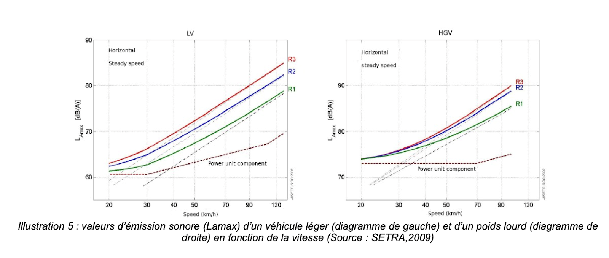

# **VIE SOCIALE DES DONNÉES \- Automne 2024**

# **La détermination des limitations de vitesse**

*Antoine ASSELIN \- Jéremy CHABOCHE \- Augustin DE MEAUX \- Martin PARNAUDEAU \- Mathis POIRIER \- Anaïs SERVAIS*

# Table des matières
* [INTRODUCTION](#introduction)
* [1. HISTOIRE DE LA LIMITATION DE VITESSE](#1-histoire-de-la-limitation-de-vitesse)
* [2. FACTEURS-CLÉS DE DÉTERMINATION](#2-facteurs-clés-de-détermination)
* [3. APPROCHE COMPARÉE DES INITIATIVES MISES EN OEUVRE HORS DE FRANCE](#3-approche-comparée-des-initiatives-mises-en-oeuvre-hors-de-france)

# **INTRODUCTION**

En 2018, le gouvernement français décidait **l’abaissement de la limitation de vitesse à 80 km/h sur les routes secondaires** hors agglomération sans séparateur central. L’objectif principal de cette mesure était la réduction de la mortalité sur les routes de France. Quelques mois plus tard éclate un mouvement social sans précédent, dit des “Gilets Jaunes” qui donne lieu notamment à des occupations de ronds-points et à des destructions de radars de contrôle automatique de la vitesse. Le gouvernement reviendra finalement partiellement sur cette mesure en 2020, en donnant la possibilité aux conseils départementaux de revenir à 90 km/h sur certains tronçons. On voit bien ici les enjeux résultant de l’**indicateur que constitue la limitation de vitesse** (jeu de données \= les limitations de vitesse) qui intervient dans le quotidien de millions de Français et dont les effets dépassent la simple question de la régulation du trafic. 

Par limitation de vitesse, il faut entendre vitesse maximale autorisée fixée par l’autorité de police. Elle est ponctuelle, c’est à dire qu’elle porte sur un kilométrage limité et est portée à la connaissance des usagers par des panneaux. **A priori, la limitation de la vitesse apparaît comme une détermination objective selon les facteurs accidentogènes.** Il s’agit d’une mesure permettant de maximiser la sécurité des différents usagers de la route. Cependant, il faut constater que ce **jeu de données demeure une construction sociale et un instrument politique**. La diversité de systèmes dans le monde et notamment en Europe en témoigne, avec des fortes différences de politique de limitation de la vitesse selon les pays. 

Il s’agira donc d’interroger la façon dont les limitations de vitesse maximale sont déterminées en prenant en compte différents facteurs. Dans un premier temps, un **retour historique** sur la limitation française de la vitesse permettra de constater qu’il s’agit d’une préoccupation ancienne mais qui s’est fortement accentuée récemment. Ensuite, une **analyse multifactorielle** permettra de mettre en évidence que les limitations de vitesse sont le fruit d’un construit social (facteurs scientifique, environnemental, politique). Enfin, une **analyse comparée** des politiques publiques en matière d’aménagement routier mettra en lumière qu’il n’existe pas de consensus international en la matière et que les relations entre vitesse et accidentalité sont complexes (États-Unis, Allemagne, Pays-Bas).

# 1. **HISTOIRE DE LA LIMITATION DE VITESSE**

## 1. **Les débuts de la limitation de la vitesse (1893-1962)**

Alors que les premiers temps de l’automobile avaient donné lieu à de premières limitations de vitesse, les années 1920 voient finalement disparaître toute notion de limitation de la vitesse pour des véhicules dont les performances ne cessent de s’améliorer.

Il est tout d’abord important de constater que les **premières mesures de limitation de la vitesse qui voient le jour sont le fait d’institutions locales**, et non de mesures d’ordre national. En effet, la première mesure voit le jour à la fin du XIXème siècle : il s’agit d’une **ordonnance prise par le préfet de police de Paris en 1893** qui ne s’applique cependant que “dans Paris et dans le ressort de la Préfecture de police”. L’on peut y lire qu’une limitation de vitesse est instaurée : “ce maximum ne devra pas excéder 12 kilomètres à l’heure, dans Paris et dans les lieux habités ; il pourra être porté à 20 kilomètres, en rase campagne”.[^1] Il faut noter que l’automobile est un phénomène à ce moment-là encore nouveau. À titre indicatif, on compte environ 3 000 voitures automobiles en 1899 contre 130 000 fiacres (tirés par des chevaux) en 1895.[^2]

Une **première réglementation nationale voit le jour en 1899**, avec un décret du 10 mars qui limite la vitesse à 20 km/h en agglomération et 30 km/h en rase campagne. On relève ici d’emblée une première augmentation par rapport à l’ordonnance parisienne de 1893 : cette tendance à la hausse se poursuivra quasiment jusqu’à la fin du XXe siècle, la limitation de vitesse accompagnant les progrès des performances automobiles.

La rupture majeure qui guidera la politique routière jusqu’à la seconde moitié du XXe siècle survient en **1921 avec l’instauration d’un premier code la Route** fixé par un décret du 27 mai. La doctrine adoptée est plus que libérale puisqu’aucune limitation de vitesse n’est fixée et que la formule suivante est la seule barrière qui existe en matière de vitesse : “le conducteur \[...\] doit rester constamment maître de sa vitesse.”

Si une réglementation est instaurée sous le régime de Vichy, celle-ci est abrogée à la Libération. Cette conception libérale reste donc la norme jusqu’en 1962\.

## 2. **L’institutionnalisation de la limitation de vitesse (1962-1971)**

La rupture majeure du XXe siècle en matière de limitation de la vitesse en France apparaît en **1962 avec la limitation de la vitesse en agglomération à 60 km/h** prise par un décret du 12 octobre.

Cette décision ne surgit évidemment pas du néant mais résulte d’une prise en compte de la vitesse dans l’étude de la vitesse des véhicules et de ses effets, notamment sur l’accidentalité sur les routes de France. En effet, la vitesse comme le nombre de voitures sur les routes ont considérablement augmenté depuis les années 1920\. 

Des progrès dans l’analyse des statistiques routières ont aussi été réalisés. En effet, en 1953-1954 fut mis en place un nouveau système de comptage des accidents de la route, aidé par un traitement informatique. Ce sont ces **exploitations statistiques qui sont la cause directe de la prise en compte d’une nécessité de fixer des seuils de limitation de la vitesse.** Elle avait déjà, avant 1962, causé l’instauration de limitations de vitesse sur certaines routes et à certains moments (le week-end notamment). 

En pratique, la tolérance reste encore de mise sur les routes de France et ce n’est qu’en 1969 qu’un nouveau progrès survient avec la limitation à 90 km/h pour les nouveaux titulaires d’un permis (depuis moins d’un an).

## 3. **Les nouveaux enjeux de sécurité routière (1970-aujourd’hui)**

Un nouveau moment de rupture survient en **1970 avec la convocation d’une “Table Ronde de sécurité routière”** à l’initiative du Premier ministre Jacques Chaban-Delmas qui prend cette cause particulièrement à cœur. C’est le début de politiques qui ne cesseront de se développer jusqu’à nos jours visant à mieux prendre en compte la sécurité des différents usagers de la route. La limitation de la vitesse est ainsi fixée à 100 km/h en 1972, avant 90 km/h en 1973\. Ces chiffres seront affinés avec des adaptations aux types de routes dans les années qui suivent  (120 km/h sur les routes à deux chaussées séparée par un terre-plein central en 1974, puis 110 km/h). 

Diverses limitations sont par la suite instaurées en France avec des différenciations par temps de pluie en 1982 par exemple et de nouvelles spécificités (sur le Boulevard périphérique de Paris notamment). La dernière mesure phare est l’abaissement  de la  limitation de la vitesse en 2018 avec la limitation à 80 km/h hors agglomération sur les routes sans séparateur central hors agglomération. Cette mesure, fortement critiquée (et qui figure comme l’une des causes centrales de mouvement des Gilets Jaunes) a par la suite été remise en question, comme évoqué en introduction, avec la possibilité pour les départements de revenir sur cette décision depuis 2020 en choisissant les tronçons demeurant à 90 km/h. 

# 2. **FACTEURS-CLÉS DE DÉTERMINATION**

#   **A. L’accidentalité**

   

La question de l’accidentalité est cruciale en France, où chaque année des milliers d'accidents de la route se produisent, causant des pertes humaines et matérielles considérables. ***M. Ramond nous a expliqué qu’en France, seuls les accidents dit corporels sont comptabilisés pour faire des statistiques. Il nous a renvoyé à la définition de l’Organisation National Interministériel de la Sécurité Routière (ONSR), qui précise : “un accident corporel (mortel et non mortel) de la circulation routière est un accident qui : provoque au moins une victime, c’est-à-dire un usager tué ou blessé (ayant nécessité des soins médicaux) et survient sur une voie ouverte à la circulation publique \- Implique au moins un véhicule”.***

Une analyse approfondie des facteurs de risque permet de mieux comprendre l'accidentologie et d’identifier des mesures préventives efficaces. Cette analyse se concentre sur le type de route, leurs limitations de vitesse et les infrastructures associées, tout en prenant en compte les disparités régionales.

En 2023, la France a enregistré environ 58 000 accidents corporels sur les routes, un nombre relativement stable par rapport aux années précédentes, avec une légère baisse par rapport à 2022[^3]. Ces accidents ont causé 3 127 décès, ce qui marque une réduction par rapport à 2022, mais reste un chiffre préoccupant​. En 2023, la France a enregistré un total de 3 167 décès sur les routes de la métropole, soit une baisse de 4,3 % par rapport à 2022\. Ce bilan marque une **diminution générale de la mortalité routière, bien qu'il y ait eu des variations selon les modes de transport et les catégories d'usagers**. Les hommes représentent environ 80 % des victimes de la route, avec une incidence notable chez les jeunes adultes et les usagers de deux-roues​.  
   
## **A.1) La vitesse : un facteur important en cause dans les accidents mortels**

La **réduction des limitations de vitesse a un impact significatif sur la mortalité routière**, comme le montrent de nombreuses études et les données de l'ONISR ainsi que d'autres organismes de sécurité routière. En France, l'une des mesures les plus marquantes a été l'abaissement de la limitation de vitesse de 90 km/h à 80 km/h sur certaines routes secondaires, instaurée en juillet 2018\. Cette initiative a permis de sauver environ 300 à 400 vies par an depuis sa mise en place. L'objectif principal de cette réduction était de diminuer la gravité des collisions, un point essentiel pour prévenir des décès évitables. ***M. Ramond nous a expliqué que cette logique s’inscrivait dans une véritable doctrine de sécurité routière, qu’on appelle le  “système sûr”.***

La vitesse est un facteur multiplicateur de la gravité des accidents. Des études montrent qu'une augmentation de la vitesse moyenne de seulement 1 % entraînerait une hausse de la mortalité de 4 %. À l'inverse, réduire cette vitesse moyenne de 1 % permettrait de réduire la mortalité de manière équivalente. Cela souligne l'importance de réguler la vitesse sur les routes pour améliorer la sécurité de tous les usagers.

Un autre aspect crucial lié aux limitations de vitesse est leur impact sur le **temps de réaction et la distance de freinage**. Plus la vitesse est élevée, plus la distance nécessaire pour s'arrêter augmente. Par exemple, à 80 km/h, la distance de freinage est d'environ 57 mètres. À 90 km/h, elle atteint 70 mètres, ce qui accroît le risque de collision mortelle et diminue les chances d'éviter un accident.

En résumé, **les limitations de vitesse ont un effet direct sur la réduction de la mortalité routière en diminuant la gravité des accidents et en augmentant la capacité des conducteurs à réagir à temps**. Bien que ces mesures puissent parfois être impopulaires, elles ont prouvé leur efficacité en matière de sécurité et de préservation de vies humaines. Ainsi, si la vitesse est un facteur important de la mortalité sur les routes françaises, elle n’est pas le seul et d’autres pistes sont à explorer pour comprendre l’accidentalité sur les routes françaises. Ainsi les conditions d'entretien et le type de voies empruntées comptent grandement.

## **A.2) Type de route : une cause majeure des accidents**

Les différents **types de routes en France présentent des niveaux de risque variables**. Selon l’ONISR, l**es routes départementales et nationales concentrent environ 52 % des accidents mortels, alors qu'elles ne représentent que 40 % du trafic routier**. Plusieurs éléments expliquent ce constat : des limitations de vitesse plus élevées, des routes souvent à double sens sans séparation physique, et des croisements non régulièrement réglementés. ***Selon M. Ramond, c’est principalement ce manque d’aménagements qui est à l’origine de cette sur accidentalité des routes départementales et nationales.*** Les statistiques montrent que près de 25 % des accidents sur ces routes impliquent des collisions frontales.

Les routes communales enregistrent près de 35 % des accidents corporels, selon les données de l’INSEE. Bien que ces accidents soient souvent moins graves que ceux sur les routes nationales, ils représentent un enjeu de sécurité significatif. La présence de piétons et de cyclistes augmente le risque, et près de 15 % des accidents impliquant des piétons ont lieu sur ce type de routes.

En revanche, **les autoroutes, qui représentent 12 % du trafic routier, ne comptent que pour environ 7 % des accidents mortels**, selon l’ONISR. Cette proportion relativement basse s’explique par la présence d’infrastructures bien entretenues, de séparations physiques entre les voies, et de zones de sécurité. Les risques d’accidents sur autoroute sont principalement dus à la fatigue, qui est un facteur dans environ 20 % des accidents sur ces voies.\[3\]  
Ainsi, si la vitesse est un facteur important de la mortalité sur les routes françaises, elle n’est pas le seul, comme le montre le faible taux de mortalité sur autoroute. Ainsi les conditions d'entretien et le type de voies empruntées comptent grandement.

## **A.3) L’infrastructure routière : un facteur déterminant**

Les infrastructures jouent un rôle essentiel dans la sécurité routière. L’ONISR indique que **plus de 30 % des accidents mortels se produisent sur des routes dont l’infrastructure est dégradée ou insuffisamment sécurisée**. Les routes équipées de barrières de sécurité et de séparations physiques voient une réduction significative des collisions frontales, qui représentent près de 20 % des accidents mortels.

La signalisation et le marquage au sol influencent directement la conduite. Une étude de la Sécurité routière a montré que des marquages clairs et une signalisation visible peuvent réduire de 15 % le risque d’accidents. Pourtant, environ 25 % des routes secondaires en France présentent une signalisation vieillissante ou des marquages effacés, augmentant le risque de confusion chez les conducteurs.

L’état de la chaussée est un autre facteur critique. Selon l’INSEE, environ 18 % des accidents sont attribuables à des routes endommagées, avec des nids-de-poule ou une surface glissante. Lors de conditions climatiques défavorables, ce chiffre peut grimper jusqu’à 25 %. **La maintenance régulière et l’amélioration des infrastructures** pourraient potentiellement réduire ce chiffre de manière significative.

## **A.4) Disparités régionales : une sécurité routière variable**

La France présente des **disparités notables en termes de sécurité routière** selon les régions. ***Cependant, M. Ramond insiste pour affirmer que cette différence ne dépend pas tant des régions que des zones géographiques particulières que chacune d’elles abritent (ex : mer, montagne, villes, campagnes, …).***  En **Bretagne et en Occitanie**, les routes départementales représentent près de 60 % des accidents mortels régionaux. Ces régions possèdent un réseau routier étendu, souvent moins bien entretenu, et des infrastructures plus anciennes.

En **Île-de-France**, près de 70 % des accidents ont lieu en zone urbaine. Ces accidents impliquent souvent des piétons ou des cyclistes, qui représentent environ 30 % des victimes. La densité de trafic et la multiplicité des usagers rendent la conduite plus risquée. Les régions montagneuses comme les **Alpes et les Pyrénées** enregistrent des taux d’accident plus élevés en hiver, avec une augmentation de 20 % des accidents liés aux conditions climatiques. La présence de routes sinueuses et de conditions extrêmes en fait des zones plus dangereuses.

L’analyse de ces chiffres montre que l’accidentologie en France est influencée non seulement par la vitesse, le type de route et l’état des infrastructures, mais aussi par les particularités régionales. Pour réduire les risques, des efforts ciblés sur la modernisation des infrastructures, la maintenance accrue et des campagnes de sensibilisation régionales s’imposent.

# **B. La pollution environnementale et sonore**  
   
L'évolution des vitesses pratiquées a des répercussions sur les émissions de polluants et les nuisances sonores. Ces impacts sont examinés en termes de pollution environnementale, d'effets sur la qualité de l'air, et de contributions au bruit routier.  
   
## **B.1) Les impacts directs de la réduction des limitations de vitesse sur la pollution environnementale**  
   
La **réduction des vitesses a des effets variés sur la qualité de l'air, selon les seuils de vitesse et les conditions de circulation**. Lors d’épisodes de pollution de l’air, comme en février 2023 à Paris, des mesures temporaires d’abaissement des vitesses maximales ont été instaurées, conduisant à des bénéfices mesurables sur les émissions de particules fines et d’oxydes d’azote (CEREMA, 2020).   
   
D’après l’ADEME, **les réductions de vitesse au-delà de 70 km/h diminuent ces émissions, tandis qu’en deçà de ce seuil, l’effet peut devenir négatif**. Les vitesses optimales pour minimiser les émissions se situent entre 70 et 90 km/h (ADEME, 2014). Par ailleurs, des analyses montrent qu’une baisse des limitations de 130 à 110 km/h sur autoroute permet de réduire la consommation de carburant de 17 % pour les véhicules thermiques et de 24 % pour les véhicules électriques, renforçant ainsi les gains environnementaux (Aurélien Bigo, 2020).  

   
## **B.2) Les impacts indirects de la réduction des limitations de vitesse**  
   
Au-delà des effets immédiats, la **diminution des vitesses peut encourager un report modal vers des moyens de transport alternatifs**, tels que les trains ou les transports en commun. En rendant ces options plus attractives, cela réduit le nombre de kilomètres parcourus en voiture, contribuant à une baisse globale des émissions de polluants (Aurélien Bigo, 2020).  
   
## **B.3) Les impacts fragiles de la limitation de vitesse sur la pollution sonore**  
   
La **vitesse influence également le bruit routier, bien que les réductions d’émissions sonores restent souvent modestes**. Par exemple, une diminution de la vitesse maximale de 90 à 80 km/h réduit l’intensité sonore d’environ un décibel, une variation généralement imperceptible par l’oreille humaine. Des études, telles que celles de BruitParif, indiquent que les réductions de bruit sont plus notables dans les zones à vitesse initiale comprise entre 50 et 90 km/h, mais qu’elles restent faibles, voire nulles, pour des vitesses supérieures. Le type de véhicules en circulation, notamment la proportion de poids lourds, joue également un rôle déterminant, pouvant neutraliser les bénéfices observés pour les véhicules légers (CEREMA, 2020).  
		

# **C. La volonté politique**

Au-delà des enjeux d’accidentalité et d’environnement, la détermination de limitations de vitesse revêt en France une dimension politique particulière, notamment sur le plan économique.

## **C.1) Le coût économique de l'insécurité routière** 

Dans le cadre d’une étude réalisée en 2022, l’Observatoire national interministériel de la sécurité routière a estimé que le **coût total de l’insécurité routière en France en 2021 était de 46,3 milliards d’euros, soit 1,9% du PIB**. Le coût des accidents corporels s'établit quant à lui à 36,4 milliards d’euros, soit près de 80% du coût total.

À cet égard, le principe de sécurité routière repose sur le principe que la prévention des accidents représente un coût économique moins élevé que celui d’en gérer les conséquences. Estimé à environ 50 milliards d’euros par an, cet impact englobe les coûts directs (tels que les soins médicaux) et les coûts indirects (telle que la perte de production liée aux incapacités et décès prématurés).

En 2018, l’abaissement de la vitesse sur les routes secondaires à 80km/h a suscité de vifs débats. Cependant, les résultats ont confirmé l'efficacité de cette mesure en permettant de sauver 349 vies la première année. Diminuant les distances de freinage et la violence des collisions, la réduction de la vitesse a ainsi entraîné une baisse notable des accidents graves. 

***Pour M. Ramond, l’argument selon lequel le coût financier nécessaire nécessaire pour faire encore baisser l’accidentalité serait beaucoup plus élevé que le coût financier qu’on gagnerait à éviter ces accidents n’est pas vrai. Déjà, cela reviendrait à considérer le prix d’une vie humaine d’un point de vue strictement matériel, ce qui est éthiquement très discutable. Ensuite, il pense que même au niveau matériel, il y a des aménagement peut coûter à mettre en place et qui pourraient drastiquement réduire le coût social des accidents en France.***

## **C.2) Embouteillages : un frein à la productivité nationale** 

La baisse des limitations de vitesse sur les routes a tendance à réduire les embouteillages en fluidifiant le trafic. À haute vitesse, les variations de conduite (accélérations, freinage) créent des “ondes de choc” qui amplifient les ralentissements. En réduisant la vitesse, ces fluctuations sont réduites, rendant le trafic plus régulier. De plus, une vitesse plus basse augmente la capacité des routes, car les distances de sécurité nécessaires entre véhicules sont réduites, permettant à davantage de voitures de circuler simultanément. Cela facilite aussi les entrées et sorties sur les voies, diminuant les perturbations aux intersections. La baisse de la limitation de vitesse à 80km/h précitée a également eu des effets secondaires notables sur la fluidité du trafic (étude CEREMA) du fait de la diminution des écarts entre véhicules rapides et lents conséquente à la réduction des dépassements dangereux et des ralentissements brusques. Cette mesure n’a par ailleurs rallongé les temps de trajet qu’à hauteur d’une seconde par kilomètre.

Or, ces améliorations conséquentes à la baisse des limitations de vitesse sont d’autant plus déterminantes que le coût économique des embouteillages est important. Selon une étude (Institut d’aménagement et d’urbanisme), les embouteillages coûtent environ 17 milliards d’euros chaque année à la France. Ce montant inclut la perte de productivité liée au temps passé dans les bouchons, au surcoût de carburant et aux émissions polluantes supplémentaires. Notamment en zones urbaines, les bouchons perturbent le bon fonctionnement des entreprises et augmentent le coût des livraisons et des déplacements professionnels.

## **C.3) L’impact des amendes radar sur les finances publiques**

En sus, l’instauration des limitations de vitesse a induit le contrôle de leur respect par le pouvoir exécutif. Le non-respect de ces règles, sanctionné par des amendes, pèse alors naturellement sur les finances publiques en tant que manne pourvoyeuse de recettes substantielles.

En 2022, ces amendes ont rapporté environ 760 millions d’euros. Une partie de ces fonds est réinvestie dans des programmes de sécurité routière, telles que l’amélioration des infrastructures (signalisation, revêtements routiers) ou le financement de campagnes de sensibilisation. 

Si une majorité absolue de ces recettes est ainsi allouée à la Délégation à la sécurité routière (35%) ainsi qu’à l’agence de financement des infrastructures de transport en France (AFIT France) (20%), le reste contribue au désendettement de l’Etat (22%) et au financement des collectivités territoriales (20%), participant à l’équilibre budgétaire de l’Etat.

## **C.4) Enjeu social : la préservation des forces vives de la Nation**

Enfin, au regard des chiffres de l’accidentalité, les jeunes adultes (18-24 ans) sont surreprésentés parmi les victimes de la route. En 2023, bien que leur mortalité ait baissé (502 décès, soit \-9% par rapport à 2022), leur taux de mortalité reste important avec 92 tués par million d’habitants dans cette tranche d’âge.

Cette catégorie de la population représente un enjeu crucial pour la société française. Ces jeunes, souvent en début de carrière professionnelle ou d’études supérieures, constituent la future main-d’œuvre du pays. Leur disparition prématurée a un coût humain et économique, affectant les familles, les entreprises et les systèmes de sécurité sociale.

À cet égard, les campagnes de sensibilisation ciblent spécifiquement cette tranche d’âge. La Sécurité Routière organise ainsi des interventions dans les écoles, universités et entreprises pour rappeler les dangers de la vitesse et de l’alcool au volant. Pour le législateur, la question de la vitesse au volant chez les jeunes populations est un levier de politiques publiques récurrent. Il a également justifié l’instauration d’un permis moto intermédiaire (A2) empêchant la conduite de deux-roues aux cylindrées trop importantes.

# 3. **APPROCHE COMPARÉE DES INITIATIVES MISES EN OEUVRE HORS DE FRANCE**

## **C.1) Aux Etats-Unis, l’approche de la Safety Zone :**

Les limitations de vitesse sont déterminées aux Etats-Unis selon la **règle du “85ème percentile”** qui consiste tout d’abord à observer les vitesses auxquelles circulent les automobilistes sur une route, puis d’y retrancher 15% des vitesses les plus hautes pour déterminer la limitation de vitesse adéquate. Cette méthode remonte aux études des années 1960s menées par les autorités publiques pour déterminer les limitations de vitesse à appliquer pour les routes de campagne. En effet, la pertinence de cette méthode est avérée en milieu rural car il n’y a bien souvent qu’une seule voie dans chaque sens de circulation et il faut donc que tous les véhicules circulent à la même vitesse pour limiter les dépassements et ainsi l'occurrence de conflits[^4]. 

Ce principe a par la suite été appliqué à tous les types de routes aux Etats-Unis (autoroutes, voies rapides, centre-ville). Or, si la limitation de vitesse dépend uniquement de la variable “vitesse de circulation du conducteur moyen”, elle peut mener à une **grande insécurité routière, en particulier en zone urbaine**. C’est ainsi que de nombreux collectifs de protection des usagers américains appellent à distinguer la *road* \- en tant que route à accès restreint et à haute vitesse de circulation \- et la *street* \- en tant que rue à basse vitesse de circulation car entourée d’un environnement complexe avec des bâtiments, des obstacles, des piétons. Dans cette analyse, la *road* (route) est un vecteur de déplacement entre deux espaces alors que la *street* (rue) est un lieu de destination. 

Le modèle américain permet aussi aisément de saisir l’importance de la **correspondance entre la vitesse réglementée** (*posted speed of the road*) **et la vitesse permise par l’aménagement** (*design speed of the road*). Étant donné que la conduite est une activité subconsciente qui répond à des automatismes pour limiter la charge mentale du conducteur, un route droite, large, et sans intersections, invite à accélérer tandis qu’une route étroite, avec du mobilier urbain (chicanes, ralentisseurs, etc.) et des intersections force à “lever le pied” et ralentir. Ce mécanisme joue indépendamment de la limitation de vitesse fixée par les autorités. C’est la raison pour laquelle dans certains villages de campagne, si la réduction de la vitesse maximale autorisée ne s’accompagne pas de changement de l’architecture routière, cette dernière tend à n’avoir qu’un faible impact sur les comportements. Les ingénieurs affirment donc que “pour être sûre, une route doit communiquer à chaque conducteur le niveau de risque associé”[^5]. En d’autres termes, le conducteur doit se sentir en inconfort s’il conduit de manière dangereuse. Salt Lake City Road (large route dans un quartier résidentiel) \+ Renton City Council \- Washington (large route dans une zone scolaire).  

Paradoxalement, la culture américaine se veut sévère quant au non-respect des limitations de vitesse. Si cette affirmation est vraie au regard des sanctions encourues (détention pour un excès de vitesse supérieur à 25mph dans certains états tels que l’Illinois, coût de l’assurance auto revue à la hausse) elle l’est en particulier dans les **“school zones”**. Ces dernières sont souvent limitées à 15 ou 20mph aux heures d’entrée et de sortie des élèves. En plus d’une présence policière, les conducteurs pressés se voient dresser des amendes au montant doublées lorsqu’ils commettent une infraction à proximité d’une école infraction et les policiers appliquent cette règle avec une grande rigueur [^6]. 

## **C.2) Aux Pays-Bas : l’importance de l'aménagement urbain**

Nous avons vu au travers du modèle américain qu’au-delà de la simple limitation de vitesse, l’architecture de la route compte tout autant si ce n’est plus. Ainsi, **l’aménagement des carrefours urbains** aux Pays-Bas permet de favoriser la coexistence entre plusieurs types d’usagers par le biais de revêtements d’asphalte différenciés. Ainsi, la route principale est en béton gris, tandis que les rues secondaires des zones résidentielles sont construites avec des pavés rouges de telle sorte qu’il y ait une différenciation visuelle qui incite les conducteurs à ralentir. Par ailleurs, une surélévation est prévue aux endroits d’insertion des véhicules pour forcer les automobilistes à réduire leur vitesse. Ainsi, l’intersection ci-dessous de la ville de Bois-le-Duc représente une conception issue des guides d'aménagement routier utilisés sur le territoire[^7].  

Par ailleurs, la vitesse est régulée sur le réseau autoroutier depuis 2020\. Ainsi, si la vitesse maximale sur autoroute est de 130km/h la nuit, celle-ci est abaissée à 100km/h en journée (de 6h à 19h)[^8].

## **C.3) En Allemagne : vitesse illimitée mais mortalité limitée**

Enfin, le modèle allemand fait l’objet d’une spécificité en ce que l’Allemagne est le seul pays à ne pas avoir de limitation de vitesse sur les ⅔ des autoroutes allemandes. Bien que la vitesse maximale conseillée est 130km/h, les conducteurs peuvent la dépasser autant qu’ils le souhaitent tant que leur conduite ne met pas en danger les autres usagers. Le principe remonte aux années 1920s avec la création du réseau routier fédéral (Bundesautobahn) et s’est justifié économiquement comme un soutien au prestige de l’industrie automobile allemande et une possibilité offerte par la qualité des infrastructures routières. Bien que dépourvue de limitation de vitesse, la sécurité des autoroutes allemandes est toutefois assurée par une unité de police dédiée : l’Autobahnpolizei. Il est intéressant d’observer que les études montrent que l’Allemagne dispose de l’uns des réseaux autoroutiers les plus sûrs d’Europe avec 1,41 décès pour 1 milliard de km voyagés sur le réseau autoroutier allemand, contre 3,45 aux US, 2,13 en France et 3,66 en Italie[^9]. Pourtant, une partie significative de la population allemande remet en cause cet héritage et le développement d’un “tourisme de la vitesse”. 

[^1]:  Ordonnance du 14 août 1893 concernant le fonctionnement et la circulation, sur la voie publique. Préfecture de police. [Lien](http://www.paris1900.fr/wp-content/uploads/2012/10/code-route-1893-louis-lepine.pdf).

[^2]:  ORSELLI, Jean. *Usages et usagers de la route : pour une histoire de moyenne durée (1860-2008)*, Paris, Université Paris 1 Panthéon-Sorbonne, 2009\.

[^3]:  Bilan définitif de l'accidentalité routière 2023\. Sécurité routière. [Lien](https://www.securite-routiere.gouv.fr/actualites-page-1-189/bilan-definitif-de-laccidentalite-routiere-en-2023-baisse-de-la-mortalite).

[^4]:  US Department of Commerce, Bureau of Public Roads, Accidents on Main Rural Highways related to Speed, Driver, and Vehicule. July 1964\. [Lien](https://safety.fhwa.dot.gov/speedmgt/ref_mats/fhwasa1304/Resources3/40%20-%20Accidents%20on%20Main%20Rural%20Highways%20Related%20to%20Speed,%20Driver,%20and%20Vehicle.pdf).

[^5]:  Confessions of a recovering engineer. Transportation for a strong town. Charles L. Marohn Jr. Wiley. 2021\.

[^6]:  Speed Limit Basics. Federal Highway Administration. 2016\. [Lien](https://highways.dot.gov/sites/fhwa.dot.gov/files/2022-06/fhwasa16076.pdf).

[^7]:  A common urban intersection in the Netherlands. Bicycle Dutch. 20 février 2018\. [Lien](https://bicycledutch.wordpress.com/2018/02/20/a-common-urban-intersection-in-the-netherlands/).

[^8]:  Motorway Speed Limits of 100km/h largely advantageous. Technische Universiteit Delft. [Lien](https://www.tudelft.nl/en/stories/motorway-speed-limits-of-100-km-h-largely-advantageous).

[^9]:  Road Safety Report 2021: Germany. International Transport Forum. OECD. [Lien](https://www.itf-oecd.org/sites/default/files/germany-road-safety.pdf).

